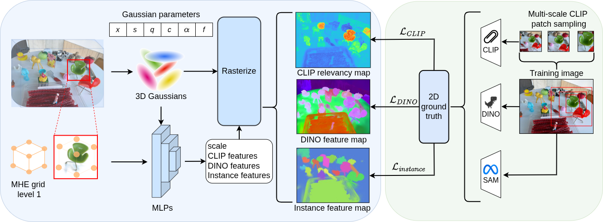

<div align="center">
<h1>Ilov3Splat: Instance-Level Open-Vocabulary 3D Scene Understanding in Gaussian Splatting</h1>

<h2> Accepted at ICPR 2026 </h2>

[**Binh Long Nguyen**](https://scholar.google.com.au/citations?user=MELpg_AAAAAJ)<sup>1,2</sup> , [**Kien Nguyen**](https://scholar.google.com.au/citations?user=18HsR5EAAAAJ)<sup>1</sup> , [**Sridha Sridharan**](https://scholar.google.com.au/citations?user=v8-lMdUAAAAJ)<sup>1</sup> , [**Clinton Fookes**](https://scholar.google.com.au/citations?user=VpaJsNQAAAAJ)<sup>1</sup> , [**Peyman Moghadam**](https://scholar.google.com.au/citations?user=QAVcuWUAAAAJ)<sup>1,2</sup>

<sup>1</sup>Queensland University of Technology&emsp;&emsp;&emsp;<sup>2</sup>CSIRO Robotics
<br>

<a href="https://arxiv.org/pdf/2605.04506.pdf"></a>
<a href="https://arxiv.org/abs/2605.04506"></a>
<a href="https://csiro-robotics.github.io/Ilov3Splat"></a>
<a href=""></a>
</div>

This repository hosts the project page and supporting materials for **Ilov3Splat**, an instance-level open-vocabulary 3D scene understanding framework built on Gaussian Splatting and accepted at ICPR 2026.




## News

- **March 2026:** Ilov3Splat is accepted to ICPR 2026.
- **May 2026:** [arXiv preprint](https://arxiv.org/abs/2605.04506) is available.
- **2026:** code will be updated when released.


## Installation


## Usage


## Acknowledgements
This work was supported in part by the Australian Research Council Discovery Project under Grant DP250103634, and in part by the Commonwealth Scientific and Industrial Research Organisation (CSIRO). The authors acknowledge continued support from the CSIRO's Embodied AI Cluster.


## Citation
If you find this repository useful, please cite:
```
@inproceedings{nguyen2026ilov3splat,
  author    = {Nguyen, Binh Long and Nguyen, Kien and Sridharan, Sridha and Fookes, Clinton and Moghadam, Peyman},
  title     = {Ilov3Splat: Instance-Level Open-Vocabulary 3D Scene Understanding in Gaussian Splatting},
  booktitle = {International Conference on Pattern Recognition (ICPR)},
  year={2026}
}
```
